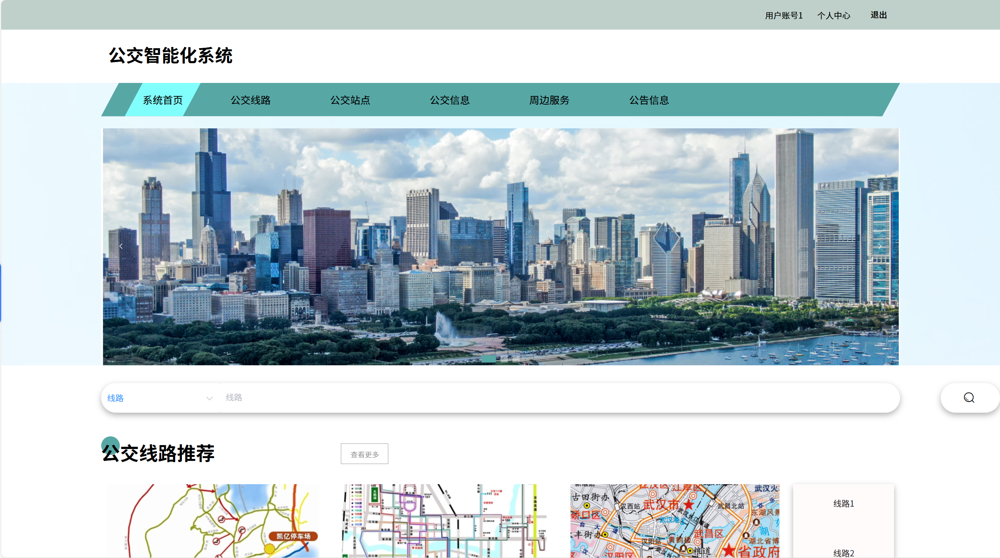
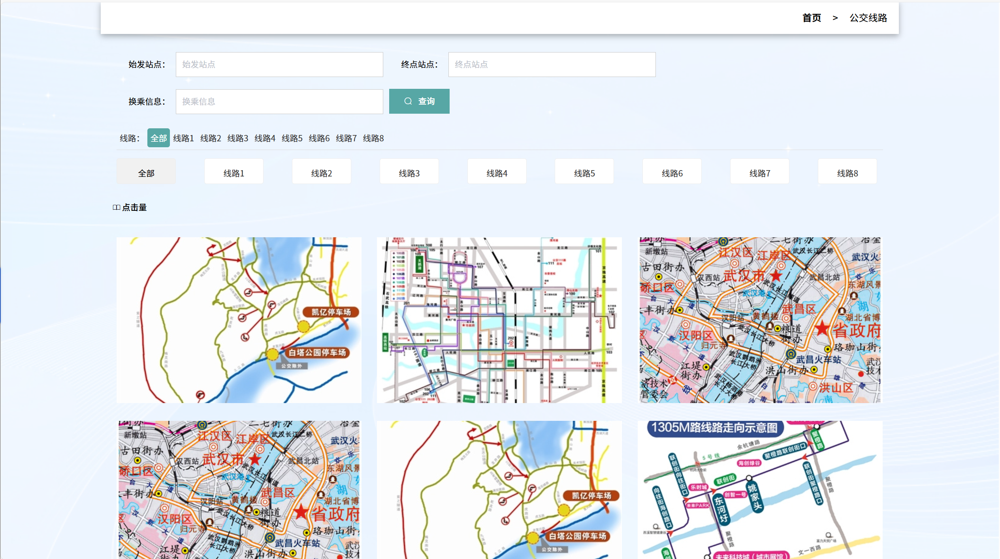
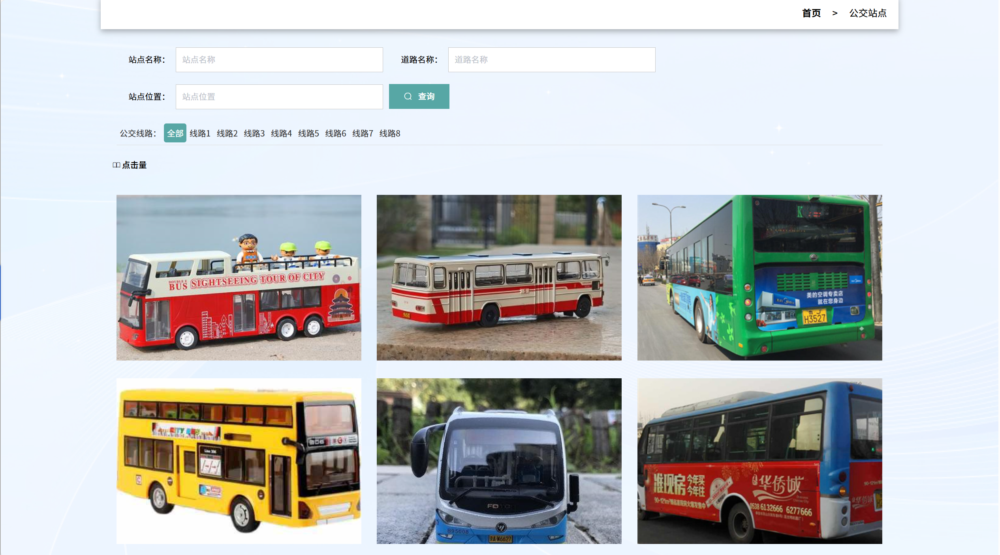
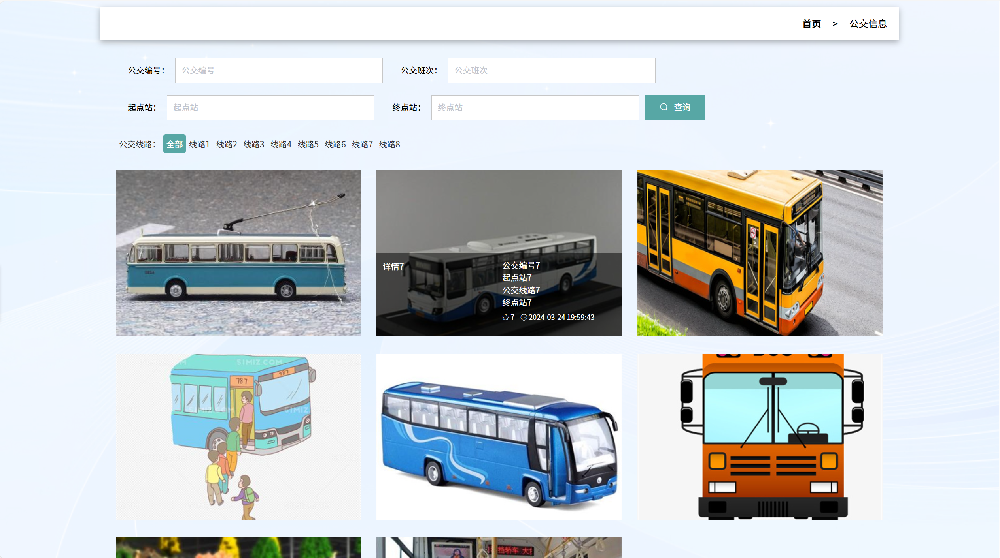
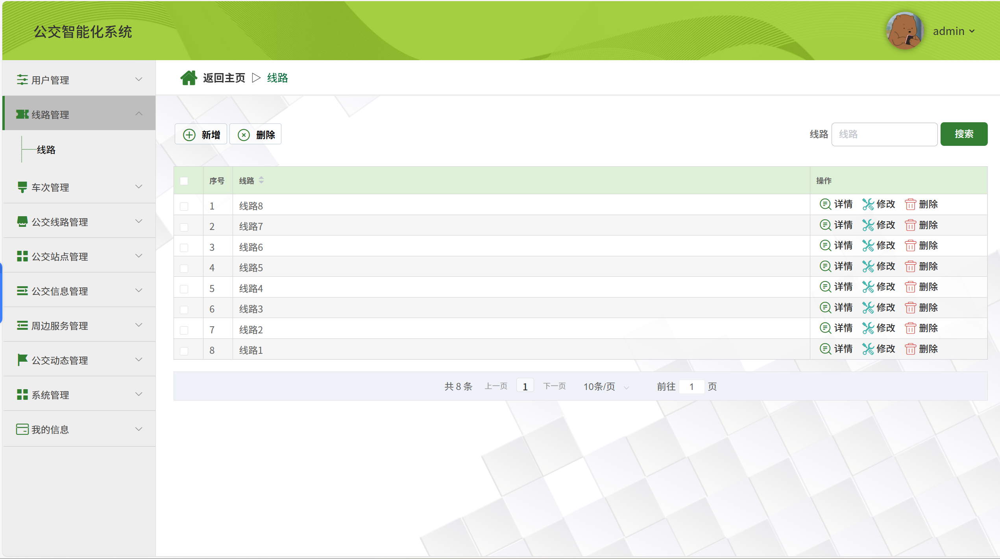
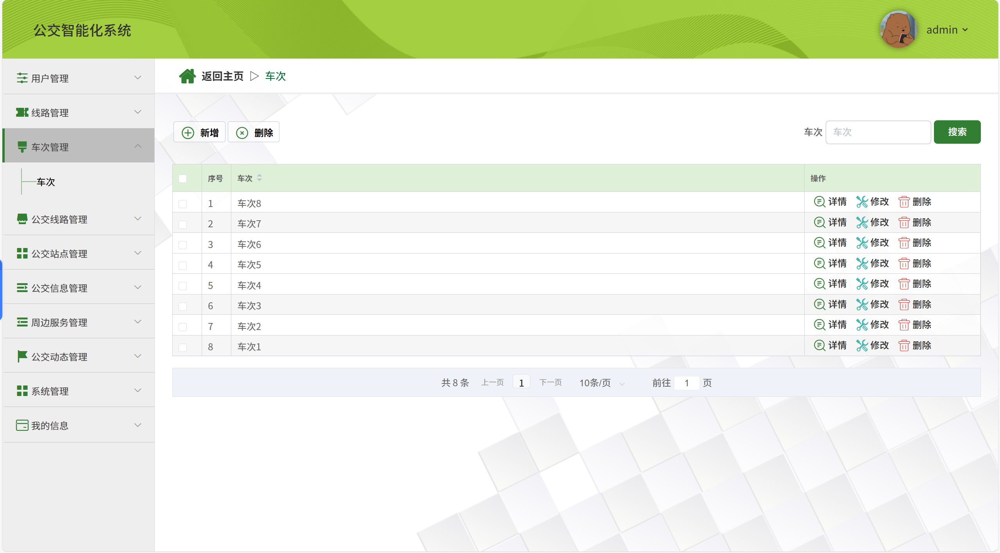
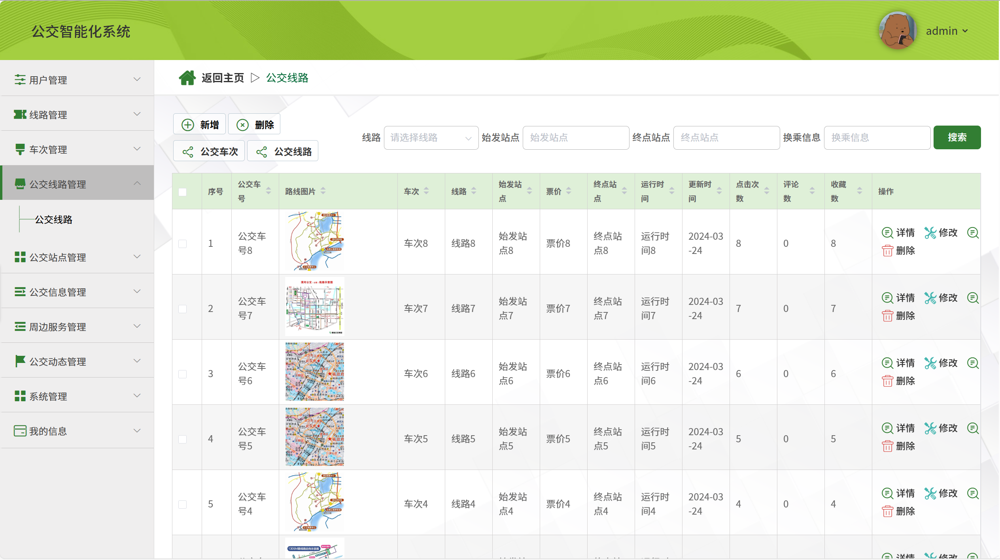
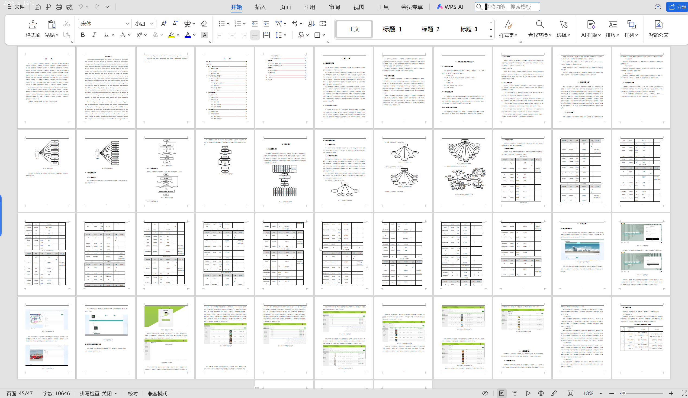

# springbootA411
springbootA411动漫交流与推荐平台+LW
 
## 查看主页获取源码

### 一、关键词

动漫社区与推荐系统，动画社交推荐平台，二次元内容交流推荐系统

 

### 二、作品包含

源码+数据库+设计文档万字+全套环境和工具资源+部署教程

 

### 三、项目技术

前端技术：Html、Css、Js、Vue2.0、Element-ui 
后端技术：Java、SpringBoot2.0、MyBatis

  

 

### 四、运行环境（以下版本亲测，其他版本未知，请自测）

开发工具：IDEA/eclipse  + VSCODE

数据库：MySQL5.7（最低要5.7版本）

数据库管理工具：Navicat10以上版本

环境配置软件： JDK1.8 + Maven3.6.3

前端Nodejs：14

浏览器：谷歌浏览器

 

### 五、项目介绍

项目编号：springbootA411

本系统为用户而设计制作动漫交流与推荐平台，旨在实现动漫智能化、现代化管理。本动漫交流与推荐平台的开发和研制的最终目的是将动漫管理的运作模式从手工记录数据转变为网络信息查询管理，从而为现代管理人员的使用提供更多的便利和条件。使动漫交流与推荐平台数字化、智能化，是提高工作效率的重要举措。
为了更好地发挥本系统的技术优势，根据动漫交流与推荐平台的需求，本文尝试以B/S经典设计模式中的Spring Boot框架，JAVA语言为基础，通过必要的编码处理、动漫交流与推荐平台整体框架、功能服务多样化和有效性的高级经验和技术实现方法，旨在完成一个快速、高效、便捷的动漫交流与推荐平台。本系统以用户与管理员两类人，作为目标用户，其中用户主要功能包含用户的注册与登录，查看动漫信息进行订阅等，对账号相关信息的修改；管理员主要功能包括了对用户信息、动漫信息、订阅信息、更新通知、在线留言、社区互动等管理；管理员可以实现最高权限级别的全系统管理。

### 六、运行截图

